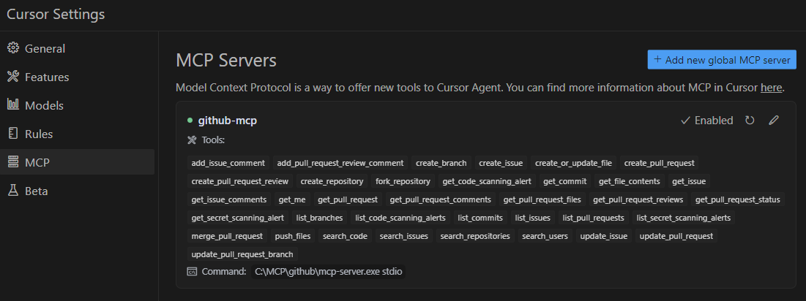

# 🚀 MCP GitHub Integration for Cursor IDE (Windows)

<div align="center">
  


**Seamlessly integrate GitHub operations within Cursor IDE on Windows**

[Installation](#-installation) • 
[How It Works](#-how-it-works) • 
[Usage Guide](#-usage-guide) • 
[Commands](#-natural-language-commands) • 
[Troubleshooting](#-troubleshooting) • 
[Resources](#-resources)

*[Versão em Português Brasileiro](README-pt-br.md)*

</div>

---

## 📋 Overview

This project demonstrates how to integrate GitHub's MCP (Model Context Protocol) Server with Cursor IDE on Windows, enabling you to perform advanced GitHub operations directly from your editor using natural language commands.

**Key Benefits:**
- Create and manage issues and pull requests without leaving your IDE
- Review, comment, and approve PRs directly in your workflow
- Manage GitHub repository features seamlessly
- Automate GitHub Actions workflows with simple commands

---

## 🔧 Installation

### Prerequisites

- [Go](https://go.dev/dl/) installed on Windows
- [Git](https://git-scm.com/download/win) installed
- [Cursor IDE](https://cursor.sh/) installed
- [GitHub personal access token](https://github.com/settings/tokens)

### Step-by-Step Guide

<details>
<summary><b>1. Install github-mcp-server</b></summary>

Create a file named `install_mcp_server.bat` with the following content:

```batch
@echo off
set REPO_URL=https://github.com/github/github-mcp-server.git
echo Creating install directory...
mkdir C:\MCP\github
cd C:\MCP\github

echo Cloning GitHub repository...
git clone %REPO_URL%
if errorlevel 1 (
    echo Error cloning repository.
    exit /b 1
)

cd github-mcp-server
echo.
echo Building MCP Server...
go build -o mcp-server.exe ./cmd/github-mcp-server
if errorlevel 1 (
    echo Error building MCP Server.
    exit /b 1
)

echo.
echo Copying executable to final directory...
copy mcp-server.exe C:\MCP\github\
if errorlevel 1 (
    echo Error copying executable.
    exit /b 1
)

echo.
echo Running MCP Server help...
C:\MCP\github\mcp-server.exe --help
if errorlevel 1 (
    echo Error running MCP Server.
    exit /b 1
)

echo.
echo Installation completed successfully!
echo The executable was installed at C:\MCP\github\mcp-server.exe
```

Run this script as administrator in Command Prompt.
</details>

<details>
<summary><b>2. Create a GitHub personal access token</b></summary>

1. Go to https://github.com/settings/tokens
2. Click "Generate new token" (Classic)
3. Name the token (e.g., "Cursor MCP Integration")
4. Select the required scopes (at least "repo" and "read:user")
5. Generate and copy the token for later use
</details>

<details>
<summary><b>3. Configure MCP in Cursor</b></summary>

1. Locate the global Cursor config folder:
   - Windows: `C:\Users\[YourUser]\.cursor`
2. Create a file named `mcp.json` in this folder (if it doesn't exist)
3. Add the following configuration:

```json
{
  "mcpServers": {
    "github-mcp": {
      "command": "C:\\MCP\\github\\mcp-server.exe",
      "args": ["stdio"],
      "env": {
        "GITHUB_PERSONAL_ACCESS_TOKEN": "your_token_here"
      }
    }
  }
}
```

4. Replace `your_token_here` with your generated GitHub token
5. Save the file and restart Cursor

> **Note:** This global config makes the MCP server available in all projects. Alternatively, you can create a project-specific config by placing `mcp.json` in the `.cursor` folder inside your project directory.
</details>

<details>
<summary><b>4. Verify the configuration</b></summary>

1. In Cursor, you should see a confirmation message that MCP is configured
2. In Cursor settings (Settings > MCP), the GitHub server should appear in the available tools list
</details>

---

## 🔄 How It Works

MCP (Model Context Protocol) enables your IDE to communicate directly with GitHub in a way that goes beyond standard Git operations:

- **Direct API Integration:** MCP interfaces with GitHub's API to perform actions that would typically require the web interface
- **Natural Language Processing:** Commands are interpreted and executed based on plain language instructions
- **Immediate Remote Reflection:** All operations are executed directly on the remote repository in real-time
- **Complementary to Git:** Standard version control still uses local Git for optimal performance

---

## 📘 Usage Guide

### Git Local Workflow (Standard Operations)

Use standard Git for all local version control operations:

| Operation | Git Command | Description |
|-----------|------------|-------------|
| Commits | `git commit -m "message"` | Record changes to the repository |
| Branching | `git branch`, `git checkout` | Create and switch between branches |
| History | `git log` | View commit history |
| Merging | `git merge`, `git rebase` | Combine branch changes |
| Syncing | `git push`, `git pull` | Sync with remote repository |

> These commands are run in your terminal or via the Source Control panel in Cursor IDE.

### MCP Workflow (Advanced GitHub Features)

Use MCP for GitHub-specific operations through natural language:

| Operation | Example MCP Command | GitHub Equivalent |
|-----------|---------------------|-------------------|
| Issues | "Create a new issue titled 'Bug in login page'" | Creating issue via GitHub UI |
| Pull Requests | "Open a pull request from feature/login to main" | Opening PR on GitHub website |
| Reviews | "Approve pull request #42" | Reviewing PR on GitHub website |
| Labels | "Add the label 'urgent' to issue #10" | Managing labels via GitHub UI |
| Repository | "Fork this repository" | Repository operations on GitHub |

> These commands are written in natural language directly in Cursor IDE.

---

## 💬 Natural Language Commands

MCP accepts commands in plain English or Portuguese. Here are some examples:

### English Commands

- "Create a new issue titled 'Login page bug'"
- "List all open issues"
- "Close issue #12"
- "Open a pull request from feature/login to main"
- "List all open pull requests"
- "Merge pull request #42"
- "Approve pull request #42"
- "Add a comment to pull request #42: Looks good!"
- "Add the label 'urgent' to issue #10"
- "Assign issue #10 to @username"

For complete command reference, see `.cursor/rules/mcp-commands.mdc`.

### Portuguese Commands

See `.cursor/rules/mcp-commands-ptbr.mdc` for Portuguese language commands.

---

## ❓ Troubleshooting

| Problem | Solution |
|---------|----------|
| **Local files out of sync** | Run `git fetch` and `git reset --hard origin/main` after MCP operations |
| **Token errors** | Verify token validity and scopes in GitHub settings |
| **MCP server not found** | Check paths in configuration and server installation |
| **Command not recognized** | Refer to the command reference and ensure proper phrasing |

---

## 📚 Resources

- **Configuration Files:**
  - `.cursor/rules/mcp-integration.mdc`: When to use Git vs MCP
  - `.cursor/rules/mcp-commands.mdc`: English command examples
  - `.cursor/rules/mcp-commands-ptbr.mdc`: Portuguese command examples

- **External Resources:**
  - [GitHub API Documentation](https://docs.github.com/en/rest)
  - [Cursor IDE Documentation](https://cursor.sh/docs)

---

<div align="center">
  
*This README is the English version. For the Portuguese Brazilian instructions, see [README-pt-br.md](README-pt-br.md).*

</div>
